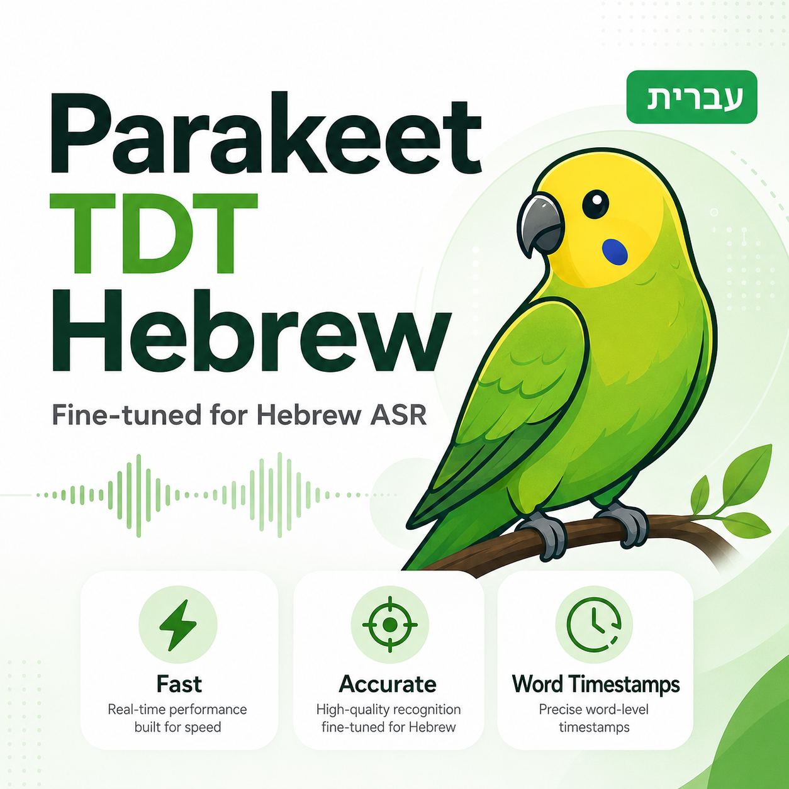
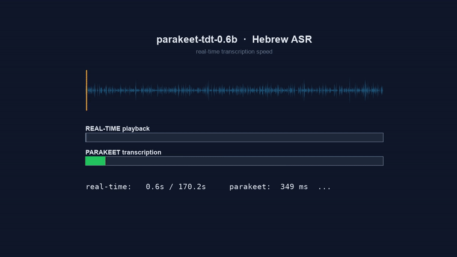

  

# 🎙️ Parakeet‑TDT 0.6B — Hebrew

**A fast, real‑time Hebrew speech‑to‑text model** — a Hebrew fine‑tune of NVIDIA's
`parakeet‑tdt‑0.6b‑v3` (FastConformer + TDT transducer), **trained on ~3,000 hours of
Hebrew** and built for low‑latency, streaming voice applications.

  
  
  
  
  
  

   
  <b>6.5 minutes (387&nbsp;s) of Hebrew audio → transcribed in ~0.5&nbsp;s — ~768× real‑time.</b> 
  ▶️ <a href="parakeet_speed_demo.mp4">Watch the full‑quality video</a>

---

## 🔴 Live experiment

A **live experiment with the model** — real‑time Hebrew transcription of a live TV broadcast.

  <video src="https://raw.githubusercontent.com/danielm1515/parakeet-tdt-0.6b-hebrew/main/parakeetheb_video.mp4" controls muted width="760"></video>
   
  ▶️ <a href="parakeetheb_video.mp4">Watch the live‑experiment video</a> 
  <i>All rights reserved to <b>Channel 10</b> and the "<b>Boker Kalkali</b>" (Economic Morning) program.
  Shown here <b>solely to demonstrate the model's performance</b>.</i>

---

## ⭐ Headline results

| | |
|---|---|
| **Word Error Rate (WER)** | **13.5 %** *(held‑out podcasts test)* |
| **Character Error Rate (CER)** | **6.1 %** |
| **Trained on** | **~3,000 hours** of diverse Hebrew |
| **Throughput** | **≈ 768× real‑time** (RTF 0.0013) |
| **Latency** (short utterance) | **≈ 62 ms** |
| One hour of audio transcribed in | **≈ 5 seconds** |

> 13.5 % WER on real Hebrew speech, at hundreds of times faster than real‑time — on a single GPU.

---

## 🏗️ How it was built

The base model, `nvidia/parakeet‑tdt‑0.6b‑v3`, covers 25 European languages **but not Hebrew**.
Turning it into a strong Hebrew model took two things:

1. **Re‑targeting the model to Hebrew** — the SentencePiece tokenizer was replaced with a
   **Hebrew BPE (1024)** vocabulary and the decoder / joint head reinitialized, keeping the
   powerful acoustic encoder.
2. **Scaling the data** — the decisive lever. Training data grew version over version,
   culminating in **~3,000 hours** of diverse Hebrew: podcasts, a large weakly‑labeled corpus,
   parliamentary speech, and recitals — trained with a **staged fine‑tuning** schedule in bfloat16,
   on **8× NVIDIA RTX 5090** GPUs.

*The takeaway from the whole process: diverse data at scale is what moved the needle —
each jump in hours produced a measurable jump in accuracy.*

---

## 📈 Version progression — measured, not guessed

Every version was scored on the **same held‑out test set** (2,000 samples). Progress was
tracked with hard numbers:

| Version | Podcasts WER / CER | Formal speech (Knesset) WER / CER | Training data |
|:--:|:--:|:--:|:--:|
| v1 | 21.6 % / 9.4 % | 40.6 % / 19.0 % | podcasts (~254 h) |
| v2 | 19.4 % / 8.2 % | 27.6 % / 13.6 % | mixed (~761 h) |
| v2.1 | 17.5 % / 7.6 % | — | ~765 h, longer fine‑tune |
| **v3 ✅ (current)** | **13.5 % / 6.1 %** | — | **~3,000 h diverse** |

**v3 cut WER by ~6 points vs v2** (19.4 → 13.5) — driven almost entirely by scaling to
~3,000 hours of diverse data. On an identical 2,000‑sample podcasts subset, the head‑to‑head is
v2 = 19.7 % → v2.1 = 17.5 % → **v3 = 13.5 %**.

---

## 🔁 Independent verification

Beyond the in‑house test, v3 was re‑evaluated on a **completely different, harder set** — real
**WhatsApp voice messages** (`ivrit‑ai/eval‑whatsapp`, spontaneous & noisy):

- **v3 → 14.0 % WER / 6.6 % CER** on WhatsApp — consistent with the 13.5 % podcasts result.

Two independent evaluations, both landing at **~13–14 % WER**. The number is real.

---

## ⚡ Speed — the differentiator

Parakeet‑TDT is built for **real‑time**. With decoding optimizations (CUDA‑graph transducer
decoding + bfloat16), throughput scales dramatically **with zero loss in accuracy**:

| Configuration | RTF | × real‑time |
|---|:--:|:--:|
| baseline | 0.0047 | ~213× |
| + CUDA‑graph decoding | 0.0032 | ~313× |
| **+ bfloat16** | **0.0013** | **~768×** |

- **~768× faster than real‑time** in throughput mode — an hour of audio in ~5 seconds.
- **~62 ms** to transcribe a spoken sentence — comfortable for live voice agents.
- Runs on a single consumer GPU.
- 💻 **No GPU? Still fast** — **~25× real‑time on CPU** (RTF 0.041, 24‑core, fp32) — an hour of audio in ~2.4 minutes, no accelerator required.

---

## ⚖️ Accuracy vs. Speed — an honest comparison

Benchmarked head‑to‑head against a strong reference on the **same WhatsApp audio**:

| Model | WER | CER | Speed |
|---|:--:|:--:|:--:|
| Whisper‑large‑v3‑turbo (Hebrew) | 7.0 % | 3.3 % | ~43× real‑time |
| **Parakeet‑TDT 0.6B Hebrew (this)** | 14.0 % | 6.6 % | **~768× real‑time** |

A deliberate trade‑off: **Whisper** is more accurate (offline, accuracy‑first). **Parakeet** is
**~18× faster** and streaming‑native — the right tool for **real‑time voice agents, live
captioning, on‑device, and high‑throughput** pipelines where latency is the constraint.

---

## 🎯 Where it shines

- 🗣️ **Real‑time voice agents** — sub‑100 ms transcription keeps conversations natural.
- 📺 **Live captioning** — transcribe as people speak.
- 📱 **On‑device / edge** — small (0.6B) and fast.
- 📦 **Bulk transcription** — an hour of audio in seconds.

---

## 🔬 Evaluation methodology

- **Held‑out test:** 2,000 samples, podcasts + formal (Knesset) domains.
- **Independent test:** real Hebrew WhatsApp voice messages — spontaneous, in‑the‑wild speech.
- **Metrics:** WER + CER with standard tooling.
- **Fair normalization:** niqqud (vowel points) and punctuation removed on both reference and
  hypothesis, so scoring reflects *words*, not diacritic/punctuation choices.
- The Whisper comparison was run on the **identical clips** with the **identical normalization**.

---

## 🚀 Roadmap

Data scale has been the single biggest lever at every step — so that's exactly where this is headed:

- 📚 **Scale training to ~20,000 hours** of Hebrew (the full ivrit.ai corpus) — roughly **6× more
  data** than v3's ~3,000 h.
- 🎯 **Target: push WER *and* CER below 10 %** — moving from "strong" to "excellent" even on
  spontaneous, in‑the‑wild speech.
- 🧩 Complementary gains planned: language‑model (KenLM) fusion and transcript self‑cleaning.

Every milestone will be validated the same disciplined way — on held‑out, real‑world Hebrew.

---

## 🙏 Credits & attribution

This model stands on the shoulders of excellent open work:

**NVIDIA**
- Base model: [`nvidia/parakeet-tdt-0.6b-v3`](https://huggingface.co/nvidia/parakeet-tdt-0.6b-v3) —
  the FastConformer‑TDT architecture and pretrained acoustic encoder this model was fine‑tuned from.
- [**NVIDIA NeMo**](https://github.com/NVIDIA/NeMo) — the toolkit used for training and inference.

**ivrit.ai** 🇮🇱 — the open Hebrew speech data that made this possible ([ivrit.ai](https://www.ivrit.ai)):
- [`ivrit-ai/audio-v2`](https://huggingface.co/datasets/ivrit-ai/audio-v2) — large weakly‑labeled
  Hebrew corpus (the bulk of the ~3,000 hours).
- [`ivrit-ai/crowd-transcribe-v5`](https://huggingface.co/datasets/ivrit-ai/crowd-transcribe-v5) —
  crowd‑transcribed podcasts.
- [`ivrit-ai/knesset-plenums-whisper-training`](https://huggingface.co/datasets/ivrit-ai) —
  parliamentary / formal speech.
- crowd‑recital data.
- Evaluation set: [`ivrit-ai/eval-whatsapp`](https://huggingface.co/datasets/ivrit-ai/eval-whatsapp).

**Comparison baseline**
- OpenAI [Whisper‑large‑v3‑turbo](https://huggingface.co/openai/whisper-large-v3-turbo), Hebrew
  fine‑tune [`ivrit-ai/whisper-large-v3-turbo-ct2`](https://huggingface.co/ivrit-ai/whisper-large-v3-turbo-ct2).

*Huge thanks to **NVIDIA** for the base model & NeMo, and to **ivrit.ai** for building and
openly sharing high‑quality Hebrew speech resources — this work would not exist without them.*

## 📄 Licenses (read before production use)
- **Base model:** NVIDIA `parakeet‑tdt‑0.6b‑v3` — CC‑BY‑4.0 + NVIDIA Open Model License.
- **This model:** CC‑BY‑4.0.
- **Data:** ivrit.ai License (custom) — permits commercial AI training; review the terms.

---

## 📌 Summary

A Hebrew ASR model that is **fast, streaming‑ready, and accurate** — **13.5 % WER**, trained on
**~3,000 hours** of Hebrew, running at **~768× real‑time**. Built through disciplined,
data‑driven, metric‑tracked iteration.

Base architecture: NVIDIA parakeet‑tdt‑0.6b‑v3 (FastConformer‑TDT). Numbers measured on real
Hebrew audio; results vary by domain and audio quality.
