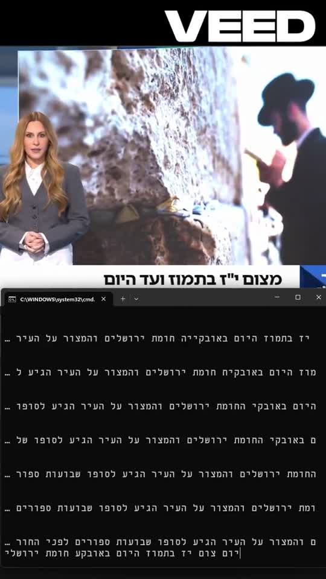

  

# 🎙️ Parakeet‑TDT 0.6B — Hebrew

**A fast, real‑time Hebrew speech‑to‑text model** — a Hebrew fine‑tune of NVIDIA's
`parakeet‑tdt‑0.6b‑v3` (FastConformer + TDT transducer), **trained on ~8,400 hours of
consensus‑cleaned Hebrew** (v4) and built for low‑latency, streaming voice applications.

  
  
  
  
  
  
  

   
  <b>6.5 minutes (387&nbsp;s) of Hebrew audio → transcribed in ~0.5&nbsp;s — ~768× real‑time.</b> 
  ▶️ <a href="parakeet_speed_demo.mp4">Watch the full‑quality video</a>

---

## 🔴 Live experiment

A **live experiment with the model** — real‑time Hebrew transcription of a live TV news broadcast.

  
   
  ▶️ <a href="https://www.veed.io/view/ac8d0806-2ba8-4aec-a0b3-7fdaf9e0bf4e"><b>Watch the video</b></a> 
  <i>All rights reserved to <b>Channel 10</b> and the "<b>Boker Kalkali</b>" (Economic Morning) program.
  Shown here <b>solely to demonstrate the model's performance</b>.</i>

---

## 🆕 v4 — the current release

**v4 improves on v3 across every benchmark** — external‑LM decoding, a 2.8× larger
consensus‑cleaned corpus (**8,391 hours**), and evaluation across multiple real‑world
Hebrew benchmarks. Full details: **[V4_REPORT.md](V4_REPORT.md)**.

| Benchmark | Content | v3 WER | **v4 WER** | Δ |
|---|---|:--:|:--:|:--:|
| **ivrit‑ai eval‑d1** | clean, directed speech | 14.19 % | **7.90 %** | **−6.29** |
| **ivrit‑ai eval‑whatsapp** | casual phone voice notes | 13.82 % | **11.37 %** | −2.45 |
| FLEURS he | encyclopedic (hard vocab) | 28.22 % | **24.71 %** | −3.51 |
| crowd‑transcribe test (20k clips) | conversational podcasts, noisy | 13.25 % | **12.13 %** | −1.12 |

With **beam search + external‑text KenLM** (5‑gram, Wikipedia + HeDC4, α=0.15) on the
20k‑clip podcasts test: **12.13 % → 11.22 % WER, 5.48 % CER**.

**What changed in v4** (see the [full report](V4_REPORT.md)):
1. **Decoding:** greedy → beam search (`malsd_batch`, beam 8) + shallow fusion with an
   external‑text 5‑gram KenLM.
2. **Data:** 3,000 h → **8,391 h** via **consensus filtering** — every clip transcribed with
   v3, compared to its Whisper pseudo‑label, and kept only when CER ≤ 0.20 (dropping the
   worst ~15 % of bad audio / bad labels).
3. **Training:** the proven staged fine‑tune (63k steps ≈ 8M samples, bf16, 8× RTX 5090),
   same budget as v3 but drawn from the larger, cleaner pool.

> On clean directed speech — the representative case for voice agents — **v4 is at 7.9 % WER,
> half of v3's error rate**, before beam/LM decoding.

---

## ⭐ Headline results (v4)

| | |
|---|---|
| **WER — clean directed speech** (eval‑d1) | **7.9 %** |
| **WER — podcasts, 20k clips** (beam+LM) | **11.2 %** |
| **Character Error Rate (CER)** | **5.5 %** |
| **Trained on** | **~8,400 hours** of consensus‑cleaned Hebrew |
| **Throughput** | **≈ 768× real‑time** (RTF 0.0013) |
| **Latency** (short utterance) | **≈ 62 ms** |
| One hour of audio transcribed in | **≈ 5 seconds** |

---

## 🏗️ How it was built

The base model, `nvidia/parakeet‑tdt‑0.6b‑v3`, covers 25 European languages **but not Hebrew**.
Turning it into a strong Hebrew model took two things:

1. **Re‑targeting the model to Hebrew** — the SentencePiece tokenizer was replaced with a
   **Hebrew BPE (1024)** vocabulary and the decoder / joint head reinitialized, keeping the
   powerful acoustic encoder.
2. **Scaling the data** — the decisive lever. Training data grew version over version,
   culminating in **~3,000 hours** of diverse Hebrew: podcasts, a large weakly‑labeled corpus,
   parliamentary speech, and recitals — trained with a **staged fine‑tuning** schedule in bfloat16,
   on **8× NVIDIA RTX 5090** GPUs.

*The takeaway from the whole process: diverse data at scale is what moved the needle —
each jump in hours produced a measurable jump in accuracy.*

---

## 📈 Version progression — measured, not guessed

Every version was scored on the **same held‑out test set** (2,000 samples). Progress was
tracked with hard numbers:

| Version | Podcasts WER / CER | Formal speech (Knesset) WER / CER | Training data |
|:--:|:--:|:--:|:--:|
| v1 | 21.6 % / 9.4 % | 40.6 % / 19.0 % | podcasts (~254 h) |
| v2 | 19.4 % / 8.2 % | 27.6 % / 13.6 % | mixed (~761 h) |
| v2.1 | 17.5 % / 7.6 % | — | ~765 h, longer fine‑tune |
| v3 | 13.5 % / 6.1 % | — | ~3,000 h diverse |
| **v4 ✅ (current)** | **11.2 % / 5.5 %** *(beam+LM)* | — | **~8,400 h consensus‑cleaned** |

**v3 cut WER by ~6 points vs v2** (19.4 → 13.5), driven by scaling to ~3,000 hours;
**v4 cut another ~2 points on the hardest benchmark** (13.25 → 11.22 with beam+LM) and —
more importantly — **halved the error on clean directed speech** (14.2 → 7.9), showing the
extra consensus‑cleaned data generalizes far beyond the in‑domain podcast set.

---

## 🔁 Independent verification

Beyond the in‑house test, v3 was re‑evaluated on a **completely different, harder set** — real
**WhatsApp voice messages** (`ivrit‑ai/eval‑whatsapp`, spontaneous & noisy):

- **v3 → 14.0 % WER / 6.6 % CER** on WhatsApp — consistent with the 13.5 % podcasts result.

Two independent evaluations, both landing at **~13–14 % WER**. The number is real.

---

## ⚡ Speed — the differentiator

Parakeet‑TDT is built for **real‑time**. With decoding optimizations (CUDA‑graph transducer
decoding + bfloat16), throughput scales dramatically **with zero loss in accuracy**:

| Configuration | RTF | × real‑time |
|---|:--:|:--:|
| baseline | 0.0047 | ~213× |
| + CUDA‑graph decoding | 0.0032 | ~313× |
| **+ bfloat16** | **0.0013** | **~768×** |

- **~768× faster than real‑time** in throughput mode — an hour of audio in ~5 seconds.
- **~62 ms** to transcribe a spoken sentence — comfortable for live voice agents.
- Runs on a single consumer GPU.
- 💻 **No GPU? Still fast** — **~25× real‑time on CPU** (RTF 0.041, 24‑core, fp32) — an hour of audio in ~2.4 minutes, no accelerator required.

---

## ⚖️ Accuracy vs. Speed — an honest comparison

Benchmarked head‑to‑head against `ivrit‑ai/whisper‑large‑v3‑turbo` on **identical clips with
identical normalization** (v4, greedy decoding):

| Benchmark | **Parakeet v4 (this)** | ivrit‑ai Whisper turbo |
|---|:--:|:--:|
| eval‑d1 (clean) | 7.90 % | **4.80 %** |
| eval‑whatsapp | 11.37 % | **7.68 %** |
| FLEURS he | 24.71 % | **18.88 %** |

A deliberate trade‑off: **Whisper turbo** is more accurate (~3–6 WER lower) — expected, as it
is larger (809M vs 617M) and was *pretrained* on Hebrew, while parakeet‑tdt saw **no Hebrew
at all** before this fine‑tune. **Parakeet** is **many× faster** and **streaming‑native**
(TDT transducer) — the right tool for **real‑time voice agents, live captioning, on‑device,
and high‑throughput** pipelines where latency is the constraint.

---

## 🎯 Where it shines

- 🗣️ **Real‑time voice agents** — sub‑100 ms transcription keeps conversations natural.
- 📺 **Live captioning** — transcribe as people speak.
- 📱 **On‑device / edge** — small (0.6B) and fast.
- 📦 **Bulk transcription** — an hour of audio in seconds.

---

## 🔬 Evaluation methodology

- **Held‑out test:** 2,000 samples, podcasts + formal (Knesset) domains.
- **Independent test:** real Hebrew WhatsApp voice messages — spontaneous, in‑the‑wild speech.
- **Metrics:** WER + CER with standard tooling.
- **Fair normalization:** niqqud (vowel points) and punctuation removed on both reference and
  hypothesis, so scoring reflects *words*, not diacritic/punctuation choices.
- The Whisper comparison was run on the **identical clips** with the **identical normalization**.

---

## 🚀 Roadmap

v4 delivered two of the previous roadmap items (data scaling with self‑cleaning, and KenLM
fusion). The credible next steps, per the [v4 error analysis](V4_REPORT.md):

- 🧪 **Knowledge distillation:** re‑label the 8,391 h corpus with `ivrit‑ai/whisper‑large‑v3‑turbo`
  (a far better teacher than the original pseudo‑labels), then retrain — distilling
  Whisper‑grade accuracy into a fast streaming model.
- 📏 **Larger base:** `parakeet‑tdt‑1.1b` with the same recipe.
- 🎯 **Domain‑matched data:** a few hundred hours of the actual target audio remains the most
  reliable lever for any specific use case.

Every milestone is validated the same disciplined way — on held‑out, real‑world Hebrew.

---

## 🙏 Credits & attribution

This model stands on the shoulders of excellent open work:

**NVIDIA**
- Base model: [`nvidia/parakeet-tdt-0.6b-v3`](https://huggingface.co/nvidia/parakeet-tdt-0.6b-v3) —
  the FastConformer‑TDT architecture and pretrained acoustic encoder this model was fine‑tuned from.
- [**NVIDIA NeMo**](https://github.com/NVIDIA/NeMo) — the toolkit used for training and inference.

**ivrit.ai** 🇮🇱 — the open Hebrew speech data that made this possible ([ivrit.ai](https://www.ivrit.ai)):
- [`ivrit-ai/audio-v2`](https://huggingface.co/datasets/ivrit-ai/audio-v2) — large weakly‑labeled
  Hebrew corpus (the bulk of the ~3,000 hours).
- [`ivrit-ai/crowd-transcribe-v5`](https://huggingface.co/datasets/ivrit-ai/crowd-transcribe-v5) —
  crowd‑transcribed podcasts.
- [`ivrit-ai/knesset-plenums-whisper-training`](https://huggingface.co/datasets/ivrit-ai) —
  parliamentary / formal speech.
- crowd‑recital data.
- Evaluation set: [`ivrit-ai/eval-whatsapp`](https://huggingface.co/datasets/ivrit-ai/eval-whatsapp).

**Comparison baseline**
- OpenAI [Whisper‑large‑v3‑turbo](https://huggingface.co/openai/whisper-large-v3-turbo), Hebrew
  fine‑tune [`ivrit-ai/whisper-large-v3-turbo-ct2`](https://huggingface.co/ivrit-ai/whisper-large-v3-turbo-ct2).

*Huge thanks to **NVIDIA** for the base model & NeMo, and to **ivrit.ai** for building and
openly sharing high‑quality Hebrew speech resources — this work would not exist without them.*

## 📄 Licenses (read before production use)
- **Base model:** NVIDIA `parakeet‑tdt‑0.6b‑v3` — CC‑BY‑4.0 + NVIDIA Open Model License.
- **This model:** CC‑BY‑4.0.
- **Data:** ivrit.ai License (custom) — permits commercial AI training; review the terms.

---

## 📌 Summary

A Hebrew ASR model that is **fast, streaming‑ready, and accurate** — **7.9 % WER on clean
speech / 11.2 % on hard conversational podcasts (v4)**, trained on **~8,400 hours** of
consensus‑cleaned Hebrew, running at **~768× real‑time**. Built through disciplined,
data‑driven, metric‑tracked iteration.

Base architecture: NVIDIA parakeet‑tdt‑0.6b‑v3 (FastConformer‑TDT). Numbers measured on real
Hebrew audio; results vary by domain and audio quality.
